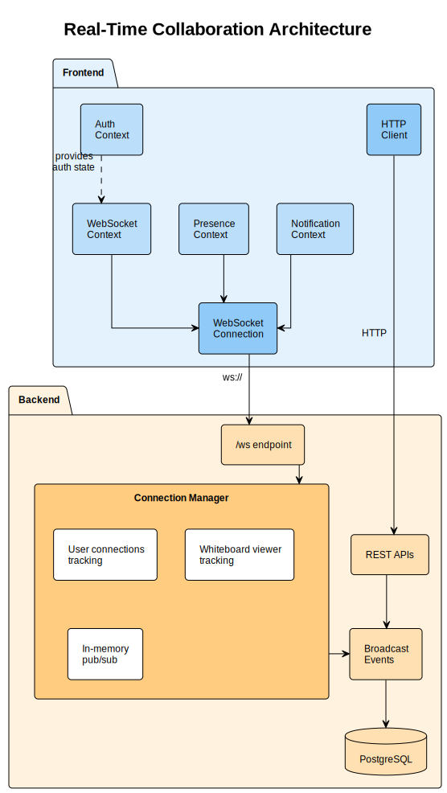

# Scribblydo

## Overview

Add real-time collaboration features to the Todo Whiteboard application including live cursor tracking, instant note updates, user presence, notifications with mute/unmute, and direct/group messaging.

---

## Requirements Summary

1. **Real-time whiteboard sync**: Notes created/moved/edited/deleted visible instantly to all viewers
2. **Cursor tracking**: See other users' mouse cursors on shared whiteboards
3. **User presence**: Right sidebar showing online users and who's viewing current board
4. **Notifications**: Popups for changes on boards not currently viewing, with mute/unmute per board
5. **Chat**: Direct messaging and group chat, persisted to DB, delivered via WebSocket
6. **Whiteboard renaming**: Ensure rename functionality works (minor fix needed)

---

## Architecture



---

## Database Changes

### New Tables (Migration 004)

```sql
-- Chat rooms (DM and group)
CREATE TABLE chat_rooms (
    id UUID PRIMARY KEY DEFAULT gen_random_uuid(),
    name VARCHAR(255),  -- NULL for DMs
    is_group BOOLEAN NOT NULL DEFAULT false,
    created_at TIMESTAMP WITH TIME ZONE DEFAULT NOW(),
    updated_at TIMESTAMP WITH TIME ZONE DEFAULT NOW()
);

-- Chat room members
CREATE TABLE chat_room_members (
    id UUID PRIMARY KEY DEFAULT gen_random_uuid(),
    room_id UUID NOT NULL REFERENCES chat_rooms(id) ON DELETE CASCADE,
    user_id UUID NOT NULL REFERENCES users(id) ON DELETE CASCADE,
    joined_at TIMESTAMP WITH TIME ZONE DEFAULT NOW(),
    last_read_at TIMESTAMP WITH TIME ZONE,
    UNIQUE(room_id, user_id)
);

-- Messages
CREATE TABLE messages (
    id UUID PRIMARY KEY DEFAULT gen_random_uuid(),
    room_id UUID NOT NULL REFERENCES chat_rooms(id) ON DELETE CASCADE,
    sender_id UUID NOT NULL REFERENCES users(id) ON DELETE CASCADE,
    content TEXT NOT NULL,
    created_at TIMESTAMP WITH TIME ZONE DEFAULT NOW(),
    is_deleted BOOLEAN NOT NULL DEFAULT false
);

-- Notification preferences (mute per board)
CREATE TABLE notification_preferences (
    id UUID PRIMARY KEY DEFAULT gen_random_uuid(),
    user_id UUID NOT NULL REFERENCES users(id) ON DELETE CASCADE,
    whiteboard_id UUID NOT NULL REFERENCES whiteboards(id) ON DELETE CASCADE,
    is_muted BOOLEAN NOT NULL DEFAULT false,
    created_at TIMESTAMP WITH TIME ZONE DEFAULT NOW(),
    UNIQUE(user_id, whiteboard_id)
);
```

---

## WebSocket Protocol

### Message Format

```json
{
    "type": "message_type",
    "payload": { ... }
}
```

### Client → Server Messages

| Type | Payload | Description |
|------|---------|-------------|
| `auth` | `{token}` | Authenticate (must be first message) |
| `join_whiteboard` | `{whiteboard_id}` | Start viewing a board |
| `leave_whiteboard` | `{}` | Stop viewing |
| `cursor_move` | `{x, y}` | Update cursor position |
| `send_message` | `{room_id, content}` | Send chat message |
| `typing_start` | `{room_id}` | Start typing indicator |
| `typing_stop` | `{room_id}` | Stop typing indicator |

### Server → Client Messages

| Type | Payload | Description |
|------|---------|-------------|
| `note_created` | `{note, by_user}` | Note was created |
| `note_updated` | `{note, by_user}` | Note was updated |
| `note_deleted` | `{note_id, by_user}` | Note was deleted |
| `note_moved` | `{note_id, x, y, by_user}` | Note position changed |
| `whiteboard_updated` | `{whiteboard, by_user}` | Whiteboard renamed/updated |
| `cursor_update` | `{user_id, username, x, y}` | Other user's cursor |
| `user_joined` | `{user, viewers}` | User joined whiteboard |
| `user_left` | `{user_id, viewers}` | User left whiteboard |
| `presence_update` | `{online_users}` | Online users changed |
| `new_message` | `{message}` | New chat message |
| `notification` | `{whiteboard_id, type, summary}` | Board change notification |

---

## Files to Create/Modify

### Backend - New Files

| File | Purpose |
|------|---------|
| `app/websocket/__init__.py` | Package init |
| `app/websocket/connection_manager.py` | WebSocket connection tracking & broadcasting |
| `app/websocket/handlers.py` | Message type handlers |
| `app/websocket/pubsub.py` | In-memory pub/sub for notifications |
| `app/routers/chat.py` | Chat room & message endpoints |
| `app/routers/notifications.py` | Notification preference endpoints |
| `app/routers/presence.py` | Online user endpoints |
| `app/routers/users.py` | User list/search endpoints |
| `alembic/versions/004_add_realtime_collaboration.py` | DB migration |

### Backend - Modify

| File | Changes |
|------|---------|
| `app/models.py` | Add ChatRoom, ChatRoomMember, Message, NotificationPreference models |
| `app/schemas.py` | Add schemas for new models and WebSocket messages |
| `app/main.py` | Add WebSocket endpoint, new routers |
| `app/routers/notes.py` | Broadcast events after CRUD operations |
| `app/routers/whiteboards.py` | Broadcast events after updates |
| `requirements.txt` | Add websockets package |

### Frontend - New Files

| File | Purpose |
|------|---------|
| `context/WebSocketContext.jsx` | WebSocket connection & subscription management |
| `context/PresenceContext.jsx` | Online users state |
| `context/ChatContext.jsx` | Chat rooms & messages state |
| `context/NotificationContext.jsx` | Notifications & mute preferences |
| `hooks/useWebSocket.js` | WebSocket access hook |
| `hooks/usePresence.js` | Presence state hook |
| `hooks/useChat.js` | Chat functionality hook |
| `hooks/useCursors.js` | Cursor tracking hook |
| `hooks/useNotifications.js` | Notifications hook |
| `components/cursors/CursorOverlay.jsx` | Renders remote cursors |
| `components/cursors/RemoteCursor.jsx` | Single cursor with username |
| `components/presence/RightSidebar.jsx` | Right sidebar container |
| `components/presence/OnlineUsers.jsx` | Online users list |
| `components/presence/WhiteboardViewers.jsx` | Users viewing current board |
| `components/chat/ChatPanel.jsx` | Chat UI container |
| `components/chat/ChatRoomList.jsx` | List of conversations |
| `components/chat/ChatRoom.jsx` | Single conversation view |
| `components/chat/MessageList.jsx` | Messages display |
| `components/chat/MessageInput.jsx` | Message composer |
| `components/notifications/NotificationToast.jsx` | Popup notification |
| `components/notifications/NotificationContainer.jsx` | Toast container |
| `styles/RightSidebar.module.css` | Right sidebar styles |
| `styles/CursorOverlay.module.css` | Cursor overlay styles |
| `styles/Chat.module.css` | Chat component styles |
| `styles/Notifications.module.css` | Notification styles |

### Frontend - Modify

| File | Changes |
|------|---------|
| `App.jsx` | Add new context providers, right sidebar |
| `main.jsx` | Wrap with WebSocketProvider |
| `hooks/useNotes.js` | Subscribe to real-time note events |
| `hooks/useWhiteboards.js` | Subscribe to real-time whiteboard events |
| `components/Whiteboard.jsx` | Add cursor overlay, track mouse movement |
| `components/Sidebar.jsx` | Add mute/unmute button per board |
| `styles/global.css` | Adjust layout for right sidebar |

---

## Implementation Order

### Phase 1: WebSocket Foundation

1. Create `app/websocket/connection_manager.py` with connection tracking
2. Add WebSocket endpoint to `main.py`
3. Create `WebSocketContext.jsx` on frontend
4. Test basic connect/disconnect

### Phase 2: Real-Time Notes

1. Modify `routers/notes.py` to broadcast after CRUD
2. Modify `routers/whiteboards.py` to broadcast after updates
3. Update `useNotes.js` to subscribe to WebSocket events
4. Update `useWhiteboards.js` to subscribe to WebSocket events
5. Test: Two users see each other's changes instantly

### Phase 3: Cursor Tracking

1. Add cursor message handlers to backend
2. Create `useCursors.js` hook
3. Create `CursorOverlay.jsx` and `RemoteCursor.jsx`
4. Modify `Whiteboard.jsx` to track mouse and render cursors
5. Test: Users see each other's cursors

### Phase 4: User Presence & Right Sidebar

1. Add presence tracking to ConnectionManager
2. Create `routers/presence.py` and `routers/users.py`
3. Create `PresenceContext.jsx` and `usePresence.js`
4. Create `RightSidebar.jsx` with online users list
5. Update `App.jsx` layout for right sidebar
6. Test: Users appear/disappear from online list

### Phase 5: Notifications

1. Create DB migration for `notification_preferences`
2. Create `routers/notifications.py`
3. Add notification broadcasting to ConnectionManager
4. Create `NotificationContext.jsx` and components
5. Add mute/unmute button to whiteboard list in Sidebar
6. Test: Receive notifications for boards not viewing, mute works

### Phase 6: Chat System

1. Create DB migration for chat tables
2. Add chat models to `models.py`
3. Create `routers/chat.py`
4. Create `ChatContext.jsx` and `useChat.js`
5. Create chat UI components
6. Test: DM and group chat work with persistence

---

## Verification Plan

### Manual Testing

```bash
# 1. Start backend with WebSocket support
cd backend && docker compose up -d

# 2. Start frontend
cd frontend && npm run dev

# 3. Open two browser windows, log in as different users

# 4. Test real-time notes:
#    - User A creates note -> User B sees it instantly
#    - User B drags note -> User A sees movement
#    - User A edits note -> User B sees changes

# 5. Test cursors:
#    - Both users view same whiteboard
#    - Move mouse -> other user sees cursor with username

# 6. Test presence:
#    - Right sidebar shows online users
#    - Shows who is viewing current board

# 7. Test notifications:
#    - User A views Board 1, User B views Board 2
#    - User B creates note on Board 1
#    - User A gets notification popup

# 8. Test mute:
#    - User A mutes Board 1
#    - User B makes changes to Board 1
#    - User A does NOT get notification

# 9. Test chat:
#    - Start DM between users
#    - Messages appear instantly
#    - Refresh page, messages persist
```

### API Testing

```bash
# WebSocket connection
wscat -c "ws://localhost:8000/ws"
> {"type": "auth", "payload": {"token": "JWT_TOKEN"}}
< {"type": "auth_success", ...}

# Join whiteboard
> {"type": "join_whiteboard", "payload": {"whiteboard_id": "UUID"}}
< {"type": "user_joined", ...}

# Cursor updates
> {"type": "cursor_move", "payload": {"x": 100, "y": 200}}
# Other connected clients receive cursor_update
```

---

## Notes

- **Cursor throttling**: Frontend throttles cursor updates to ~60fps to avoid flooding
- **Reconnection**: WebSocket auto-reconnects after 3 seconds on disconnect
- **Conflict resolution**: Last-write-wins for note edits; ignore remote position updates during local drag
- **Scalability**: In-memory pub/sub works for single server; Redis pub/sub needed for horizontal scaling
